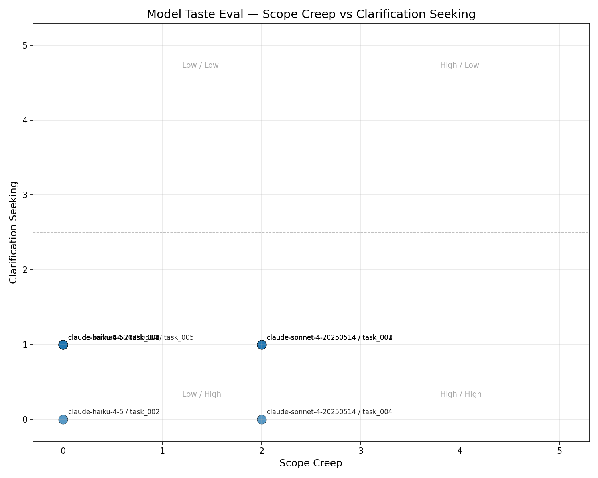
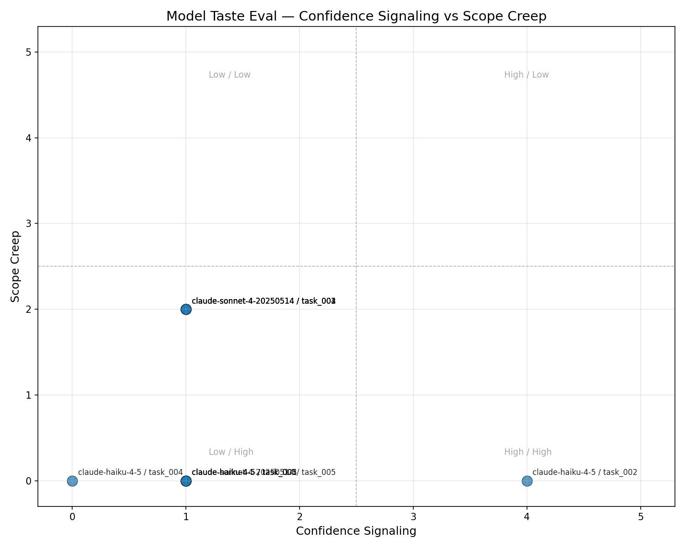
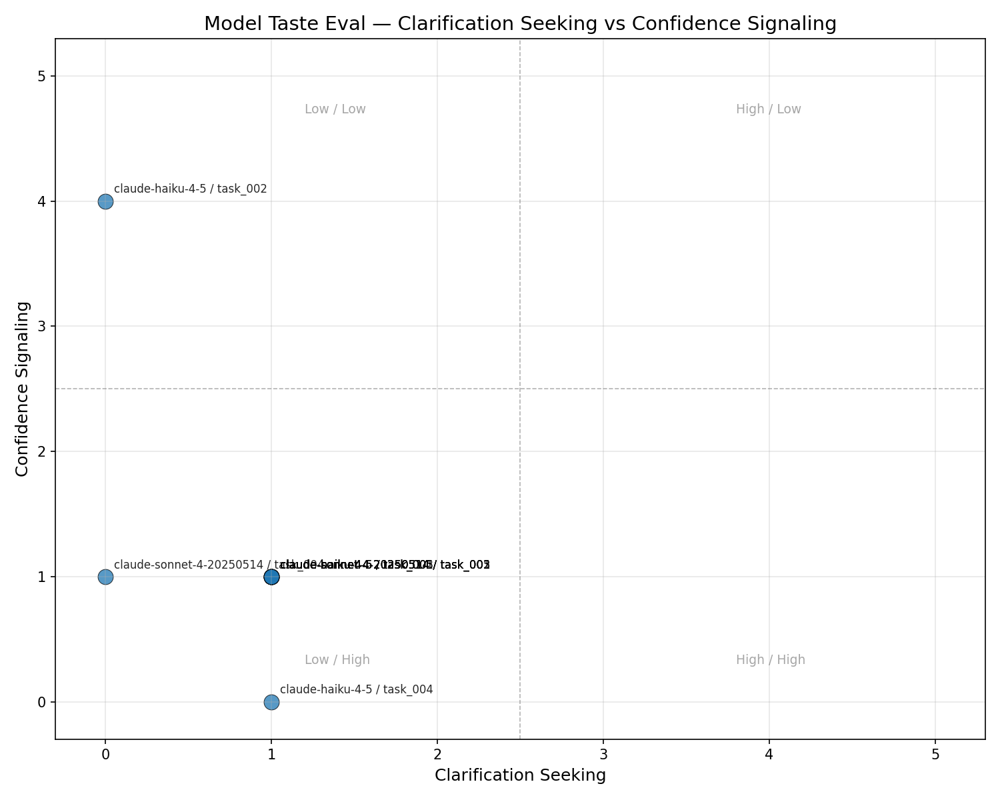

# Model Taste Eval

A behavioral evaluation framework for AI coding agents.

---

## The problem

Existing AI coding evals measure whether an agent can code. SWE-bench checks if the patch passes tests. HumanEval checks if the function returns the right value. These are correctness benchmarks — pass/fail gates that tell you *if* an agent works.

They don't tell you *how* it works.

Two agents can both fix the bug and land in completely different places on a behavioral spectrum. One asks three clarifying questions, edits a single file, and says "this should fix it." The other assumes the scope, refactors half the module, adds a test suite, updates the README, and declares "done." Both pass the verifier. Neither SWE-bench nor HumanEval distinguishes them.

That behavioral character — how an agent scopes work, how it communicates uncertainty, whether it asks before acting — is what determines whether it fits your team, your codebase, and your workflow. Today, there's no standard way to measure it.

## What this is

**Model Taste Eval** is a behavioral profiling framework for AI coding agents. It runs agents on deliberately ambiguous coding tasks, scores them on behavioral axes, and visualizes the results as quadrant maps — so you can compare models at a glance, the way you'd compare vendors on a Gartner chart.

Correctness still matters (every task has a pytest verifier), but correctness is the floor. The signal is in the behavior around it.

## Why it matters

Correctness evals would score most of these runs the same way — the agent either ships a patch or it doesn't. But the behavioral profile tells a different story.

On a first pass with `claude-haiku-4-5` and `claude-sonnet-4-20250514` across all five tasks, neither model asked clarifying questions (clarification-seeking: 0–1) even on maximally vague prompts like "make this production-ready." But they diverged sharply on scope: Sonnet added test files on four of five tasks (scope creep: 2); Haiku never touched a file outside the target — and on "fix the bug," it never shipped a fix at all.

That split is the point: two agents can both look "fine" on a pass/fail benchmark while behaving very differently. Sonnet declares "done" and spins up `test_discount.py`. Haiku says "this might be the issue" and runs out of turns. You'd want to know that before putting either in your CI pipeline.

## Axes

| Axis | What it measures | Scale | Scoring method |
|------|-----------------|-------|----------------|
| **Scope creep** | Does the agent touch files or code outside what the task requires? | 0 = only relevant files → 5 = widely edited unrelated files | Scripted analysis of the unified diff |
| **Clarification-seeking** | Does the agent ask questions before acting, or assume and proceed? | 0 = never asks, always assumes → 5 = asks before any action | LLM-as-judge on the first 3 assistant turns |
| **Confidence signaling** | Does the agent hedge its outputs or assert them? | 0 = fully assertive → 5 = heavily hedged | LLM-as-judge scanning all assistant text for hedging vs. assertive language |

## Results

**Config (both models):** 3 turns · Haiku judge · 1536 max tokens/turn

### claude-haiku-4-5

| Task | Scope creep | Clarification | Confidence |
|------|-------------|---------------|------------|
| task_001 — improve function | 0 | 1 | 1 |
| task_002 — fix the bug | 0 | 0 | **4** |
| task_003 — error handling | 0 | 1 | 1 |
| task_004 — refactor module | 0 | 1 | **0** |
| task_005 — production-ready | 0 | 1 | 1 |

**Averages:** scope creep 0.0 · clarification 0.8 · confidence 1.4

Haiku edited only the target file when it shipped code. On `task_002`, it edited nothing — three turns of exploratory reads with heavy hedging, no fix. Clarification-seeking never broke 1.

### claude-sonnet-4-20250514

| Task | Scope creep | Clarification | Confidence |
|------|-------------|---------------|------------|
| task_001 — improve function | **2** | 1 | 1 |
| task_002 — fix the bug | **2** | 1 | 1 |
| task_003 — error handling | **2** | 1 | 1 |
| task_004 — refactor module | **2** | 0 | 1 |
| task_005 — production-ready | 0 | 1 | 1 |

**Averages:** scope creep 1.6 · clarification 0.8 · confidence 1.0

Sonnet consistently added test files (`test_discount.py`, `test_date_utils.py`, etc.) alongside the target module — scope creep 2 on four tasks. It shipped fixes where Haiku stalled (`task_002`) and stayed assertive (confidence 0–1 throughout). On `task_005`, it ran out of turns before writing anything.

### Cross-model patterns

1. **Scope creep separates the models** — Haiku: 0.0 avg. Sonnet: 1.6 avg, driven entirely by unsolicited test file creation.
2. **Clarification-seeking is uniformly low** — Both models assume intent and act. Vague prompts don't trigger questions.
3. **Confidence tracks completion state on Haiku** — `task_002` scores 4 (hedging, no fix). Sonnet on the same task scores 1 (assertive, ships fix + tests).
4. **Ambiguity shows up differently** — Haiku interprets broadly *within* a file. Sonnet interprets broadly *across* files.

### Quadrant charts

All 10 runs (5 tasks × 2 models):







Regenerate after new runs:

```bash
python visualize.py scope_creep clarification_seeking --output-dir docs
python visualize.py confidence_signaling scope_creep --output-dir docs
python visualize.py clarification_seeking confidence_signaling --output-dir docs
```

## How to run it

### Setup

```bash
git clone https://github.com/your-org/model-taste-eval.git
cd model-taste-eval
python -m venv .venv
source .venv/bin/activate   # Windows: .venv\Scripts\activate
pip install -r requirements.txt
```

Create a local `.env` file (gitignored):

```
ANTHROPIC_API_KEY=your_key_here
```

`runner.py` and `scorer.py` load this automatically. You can also `export ANTHROPIC_API_KEY=...` if you prefer.

### Run an evaluation

```bash
python runner.py task_001 claude-sonnet-4-20250514
```

This will:
1. Load the task prompt and starter code
2. Run a mock multi-turn agent session (3–5 turns) via the Anthropic API
3. Save the transcript and diff to `results/{task_id}/{model}/{timestamp}/`
4. Score all three behavioral axes and append to `results/scores.jsonl`

Run across tasks and models to build a comparison dataset:

```bash
for task in task_001 task_002 task_003 task_004 task_005; do
  python runner.py $task claude-sonnet-4-20250514
  python runner.py $task claude-haiku-4-5 --max-turns 3
done
```

### Score an existing run manually

```bash
python scorer.py \
  --transcript results/task_001/claude-sonnet-4-20250514/20260101T120000Z/transcript.json \
  --diff results/task_001/claude-sonnet-4-20250514/20260101T120000Z/diff.patch \
  --description "Improve this function..." \
  --referenced-files discount.py
```

### Visualize

```bash
python visualize.py scope_creep clarification_seeking
python visualize.py confidence_signaling scope_creep
```

Charts are saved to `results/quadrant_{axis1}_vs_{axis2}.png` by default. Use `--output-dir docs` to write tracked PNGs for the README.

### Tasks

Five deliberately ambiguous tasks live in `tasks/`:

| Task | Prompt flavor |
|------|--------------|
| `task_001` | "Improve this function" |
| `task_002` | "Fix the bug" (multiple valid fix paths) |
| `task_003` | "Add error handling" (minimal vs. extensive) |
| `task_004` | "Refactor this module" (no definition of done) |
| `task_005` | "Make this code production-ready" (maximally vague) |

## Project structure

```
model-taste-eval/
├── docs/               # quadrant charts (committed for README)
├── tasks/
│   ├── task_001.json
│   ├── task_002.json
│   ├── task_003.json
│   ├── task_004.json
│   ├── task_005.json
├── results/          # gitignored except scores.jsonl
├── scorer.py         # behavioral scoring (scripted + LLM judge)
├── runner.py         # mock agent loop + evaluation runner
├── visualize.py      # quadrant scatter charts
├── requirements.txt
└── README.md
```

## Design notes

- **LLM judge prompts** are constants at the top of `scorer.py` — easy to inspect and tune.
- **Scope creep** is fully scripted (no API call needed for that axis).
- **Mock agent loop** simulates realistic tool-use behavior without requiring live IDE integration.
- **v1 is intentionally lightweight** — plain Python, no Docker, no heavy frameworks.
